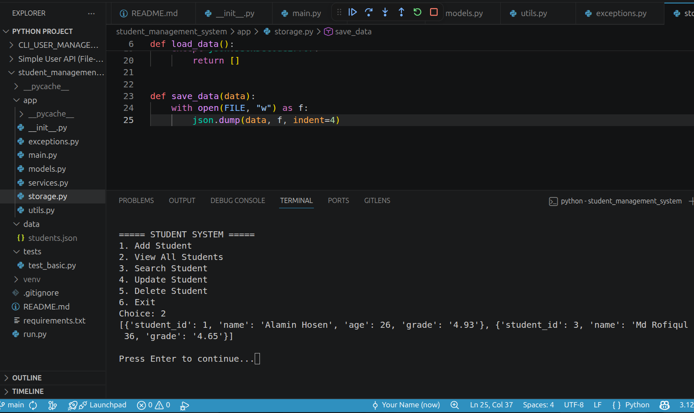

<<<<<<< HEAD
=======
A professional **Python-based CLI backend system** designed to demonstrate real-world backend fundamentals including CRUD operations, file handling, OOP principles, modular architecture, and exception handling.

---

## 🚀 Features

- ➕ Add Student  
- 📋 View All Students  
- 🔍 Search Student  
- ✏️ Update Student  
- ❌ Delete Student  
- 💾 JSON-based file storage (lightweight database simulation)  
- ⚠️ Exception handling for robust input control  
- 🧱 Clean modular backend architecture  

---

## 🧠 Tech Stack

- 🐍 Python 3  
- 📁 JSON (File-based Database)  
- 🧠 Object-Oriented Programming (OOP)  
- 💻 Command Line Interface (CLI)  

---

## 📁 Project Structure

```txt
student_management_system/
│
├── app/              # Core backend logic
├── assets/          # Screenshots / UI previews
├── data/            # JSON database storage
├── run.py           # Entry point
└── README.md

## 📸 Project Screenshots

### 🏠 Main Menu


### ➕ Add Student


### 📋 View Students


### 📄 View 2


### 🔍 Search Student


### ✏️ Update Student


### ❌ Delete Student


### 🚪 Exit


## 🚀 How to Run

```bash
python run.py

🧠 Learning Outcomes
✔ Python OOP design patterns
✔ File handling with JSON
✔ Exception handling for production-like safety
✔ Modular backend architecture
✔ CLI application development flow
✔ Real-world CRUD system design
👨‍💻 Author

Md Sagur Ali
Aspiring Python Backend Developer
>>>>>>> b4a39a1 (fix README image rendering final)
