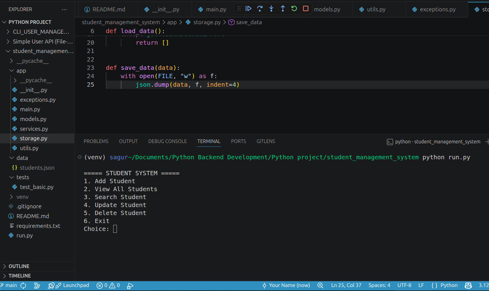
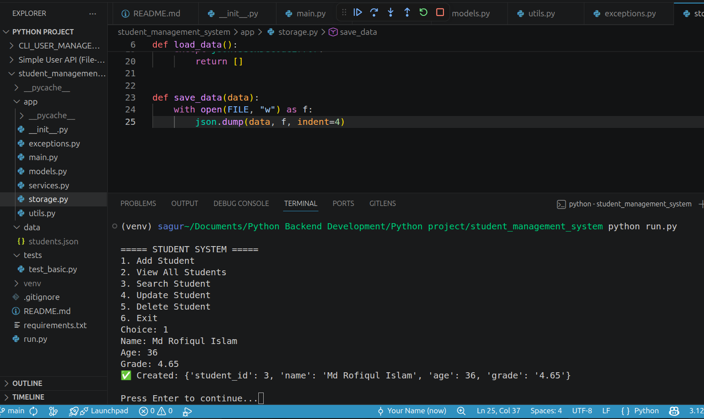
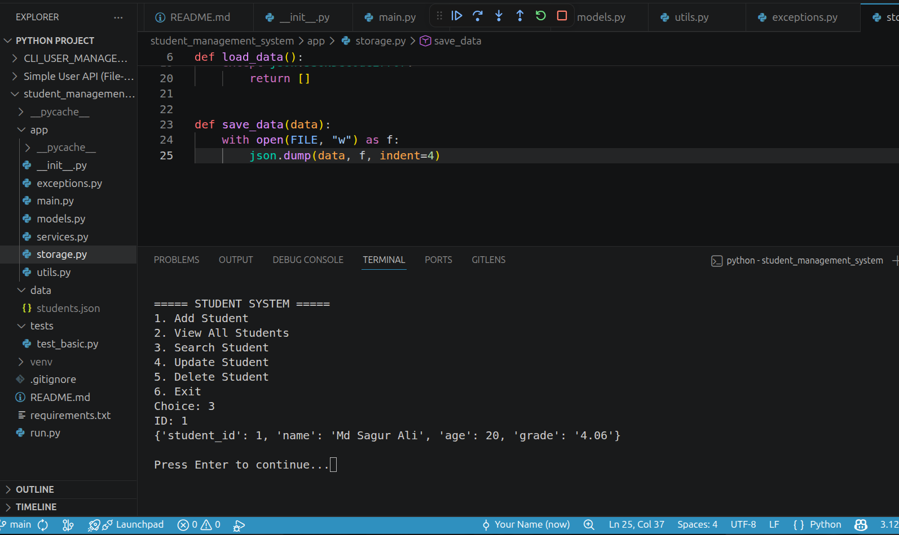
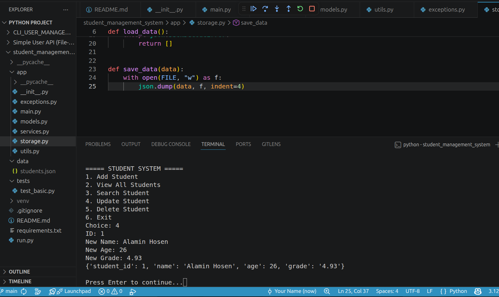
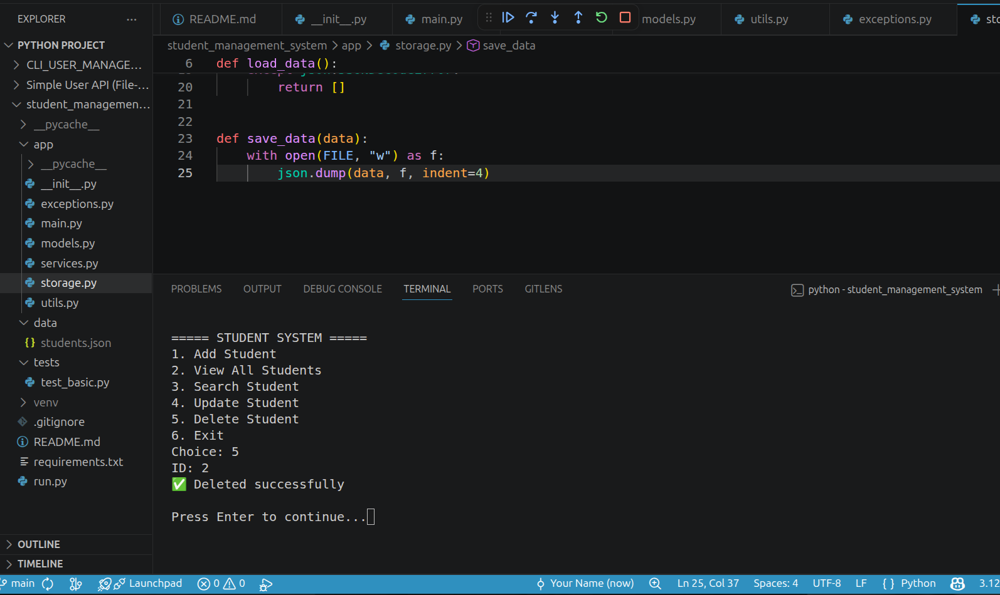
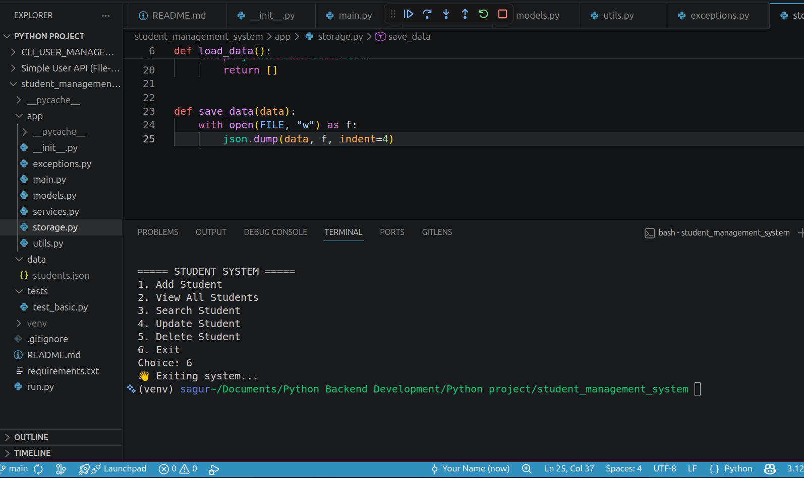

## 📦 Student Management System (CLI Backend Project)

A professional Python-based CLI backend system designed to demonstrate real-world backend fundamentals including CRUD operations, file handling, OOP principles, modular architecture, and exception handling.

---

## 🚀 Features
- ➕ Add Student  
- 📋 View All Students  
- 🔍 Search Student  
- ✏️ Update Student  
- ❌ Delete Student  

---

## 🧠 Tech Stack
- 🐍 Python 3  
- 📁 JSON File Storage  
- 🧠 Object-Oriented Programming (OOP)  
- 💻 CLI Application  

---

## 📁 Project Structure
student_management_system/
├── app/
├── assets/
├── data/
├── run.py
└── README.md

---

## 📸 Project Screenshots

### 🏠 Main Menu

### ➕ Add Student

### 📋 View Students

### 🔍 Search Student

### ✏️ Update Student

### ❌ Delete Student

### 🚪 Exit

---

## 👨‍💻 Author
Md Sagur Ali  
Aspiring Python Backend Developer